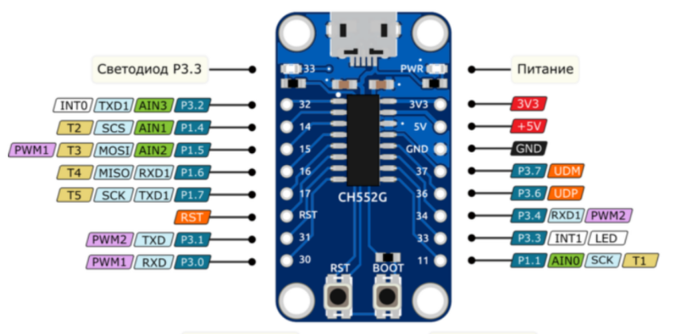

# CH552G BadUSB

> ⚠️ **DISCLAIMER**
>
> All information in this repository is provided **FOR EDUCATIONAL AND INFORMATIONAL PURPOSES ONLY**.
>
> It is assumed that any actions described here are performed solely on your own equipment.
> The author is not responsible for any damage resulting from the use of these materials.
>
> Please, stay reasonable.

## What is BadUSB
BadUSB is a **concept involving the reprogramming of USB microcontrollers to impersonate various HID devices**, such as keyboards, enabling task automation, educational use, security testing, as well as covert attacks and unauthorized control over a computer.

## Making your own BadUSB
Any microcontroller that supports HID can be used to create and test a BadUSB. In this project, I will explore the possibility of using the **MCU CH552G**.

### CH552G

| Feature                        | Description                                          |
| ------------------------------ | ---------------------------------------------------- |
| **USB Controller**             | Built-in USB 2.0 Full-Speed Device                   |
| **HID Support**                | Emulation of HID devices (keyboard, mouse, etc.)     |
| **Microcontroller Core**       | 8-bit 8051 running up to 24 MHz                      |
| **Memory**                     | 16 KB Flash for custom firmware                      |
| **Size and Power Consumption** | Compact size, low power consumption                  |

### Parts List

| Part                | Quantity        | Notes                |
|---------------------|-----------------|----------------------|
| CH552G              | 1               |                      |
| SMD Resistor (0603) | 2               | 10KΩ, 4.7KΩ          |
| SMD Capacitor (0402) | 2              | 0.1 µF               |
| USB port            | 1               |                      |
| Switch              | 2               |                      |
| LED                 | 1               |                      |

### Scheme

### PCB Fabrication
You can use the provided PDF files to make the PCB using the toner transfer method (TTF/ЛУТ).

#### PCB Front
[Download](./assets/pcb/front.pdf)

#### PCB Back
[Download](./assets/pcb/back.pdf)

### Firmware
> In the process of development...
